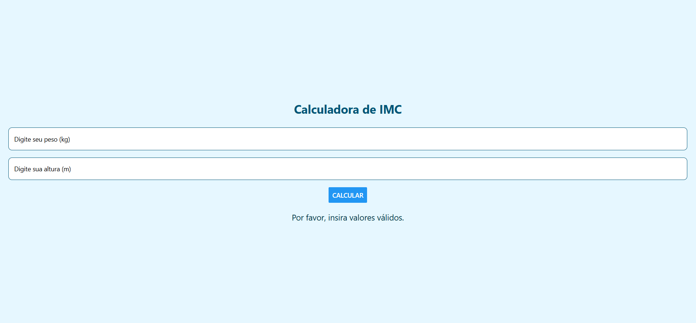
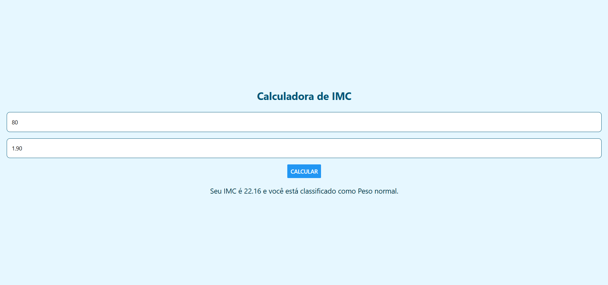

# Avaliação IMC – Calculadora de Índice de Massa Corporal

## Enunciado da Questão

Crie a mesma calculadora de IMC que foi criada em App Inventor e em Flutter no semestre passado, mas utilizando o React Native + Expo. Para isso, crie um novo projeto chamado `avaliacao_imc` e siga os passos da aula01.

O Aplicativo terá apenas uma tela, onde o usuário irá informar o peso e a altura, e ao clicar no botão "Calcular", o aplicativo irá calcular o IMC e exibir o resultado em um `<Text>`.

---

## Tecnologias Utilizadas

**React Native com Expo e TypeScript**, usando Node.js e npm para gerenciamento de pacotes, com suporte opcional ao React Native Web para execução no navegador.

---

## Primeiros passos

1. Navegue até a pasta onde deseja criar o projeto e abra com o VsCode: 
bash
code .

2. Abra uma nova janela do terminal do VsCode CTRL + ' ou CTRL + SHIFT + `


3. Certifique-se de que o Node.js, npm e expo estão instalados. Você pode verificar isso executando os seguintes comandos:
``` 
node -v
npm -v

O expo pode ser instalado globalmente com o seguinte comando:
``` 
npm install -g expo-cli

4. Execute o comando para criar um novo projeto React Native:
``` 
npx create-expo-app@latest NomeDoSeuProjeto

5. Após a criação do projeto, navegue até a pasta do projeto:
``` 
cd NomeDoSeuProjeto

6. Para executar o projeto, execute o comando:
``` 
npm start

7. Pode ser necessario instalar dependências adicionais para o React Native Web:
````
npm install -g expo-cli
npm install react-native-web --force
npm install react-dom -force
npx expo install @expo/metro-runtime

8. Para redefinir/limpar o projeto, execute o comando:
``` 
npm run reset-project

9. Agora você pode começar a desenvolver seu aplicativo React Native. Abra o arquivo app/index.tsx no diretório do seu projeto e comece a editar o código. As alterações serão refletidas automaticamente no emulador ou dispositivo conectado.

# Prints



